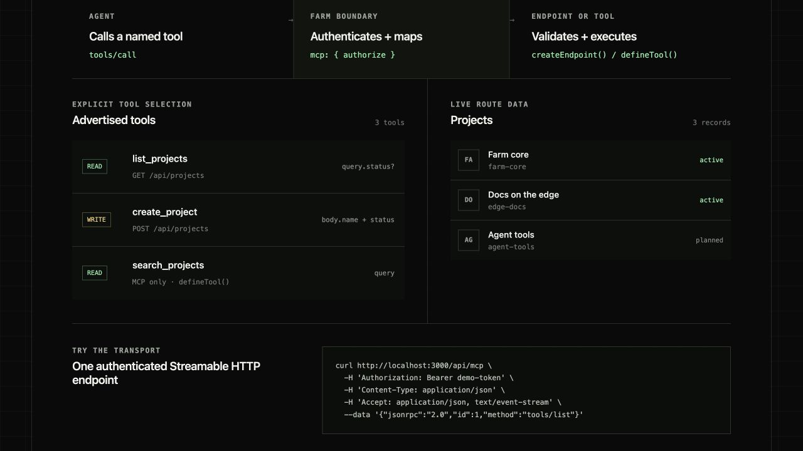

# Farm API MCP demo

This example composes two typed endpoint instances and one standalone `defineTool()` in Farm's
top-level `mcp.tools` config.
`authorize` receives the complete resolved tool catalog and returns the tool names each caller
may discover and invoke. Endpoint middleware also protects direct HTTP requests. The standalone
`search_projects` tool receives validated input and the authorized principal; it has no HTTP route.



```bash
pnpm dev
```

The MCP endpoint is `/api/mcp`. The demo token is intentionally visible and local-only:
`Authorization: Bearer demo-token`. It permits all three tools. `Bearer demo-reader` can list and
search projects: `create_project` is hidden and cannot be called through MCP; direct HTTP writes return
403. These hardcoded tokens are for the demo only, not production authentication.

The example shares a process-local demo store between config and route modules. Data resets on
restart and is not shared across server instances; use a database or shared storage in a real app.

Call the standalone tool with its schema's arguments directly:

```bash
curl http://localhost:3000/api/mcp \
  -H 'Authorization: Bearer demo-reader' \
  -H 'Content-Type: application/json' \
  -H 'Accept: application/json, text/event-stream' \
  --data '{"jsonrpc":"2.0","id":1,"method":"tools/call","params":{"name":"search_projects","arguments":{"query":"farm"}}}'
```

Both forms return application JSON under `result.structuredContent.result`. Endpoint-backed calls
retain their `params`, `query`, `body`, and `headers` input groups; standalone calls use their own
object shape.
