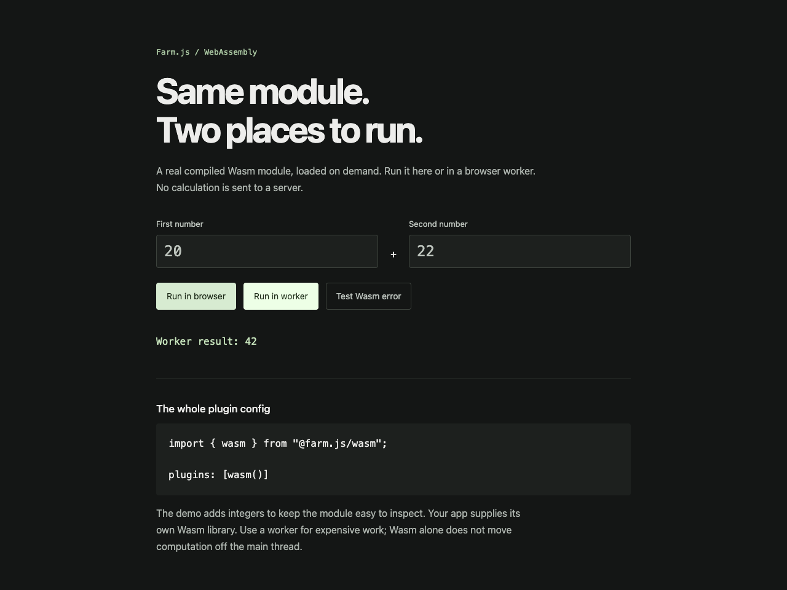
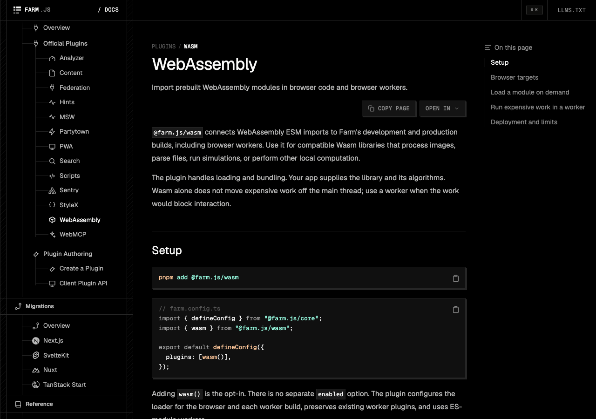

# WebAssembly demo

An executable contract for `@farm.js/wasm`: one real Wasm module runs on the browser's main thread and in a module worker. The third button deliberately divides by zero to demonstrate handled Wasm errors and recovery.



From the repository root:

```sh
pnpm install
pnpm --filter @farm.js/core build
pnpm --filter @farm.js/cli build
pnpm --filter @farm.js/react build
pnpm --filter @farm.js/wasm build
pnpm --dir examples/wasm-demo dev
```

Open the local URL printed by Farm. Development serves the page at `/`.

## Production

```sh
pnpm --dir examples/wasm-demo build
pnpm --dir examples/wasm-demo preview
```

Open `/lab/` on the preview server. The production base path intentionally exercises emitted Wasm and worker URLs. Both Farm builders are covered by `pnpm test:e2e:wasm:run`, selected with `FARM_VITE_BUILDER=rolldown` (default) or `FARM_VITE_BUILDER=rollup`.

`scripts/build-wasm.mjs` compiles the small, reviewable `src/wasm/math.wat` fixture using WABT before dev/build. No Rust toolchain is required. `math.wasm.d.ts` describes its actual exports; real libraries should provide their own generated types and JavaScript glue.

The worker registers its handler before dynamically importing the async module. The client terminates it on success, failure, and cancellation. The calculation and input stay in the browser; the only network requests load app assets.

## Documentation

The [WebAssembly guide](https://farmjs.dev/docs/plugins/wasm) is listed under Plugin Ecosystem → Official Plugins.


