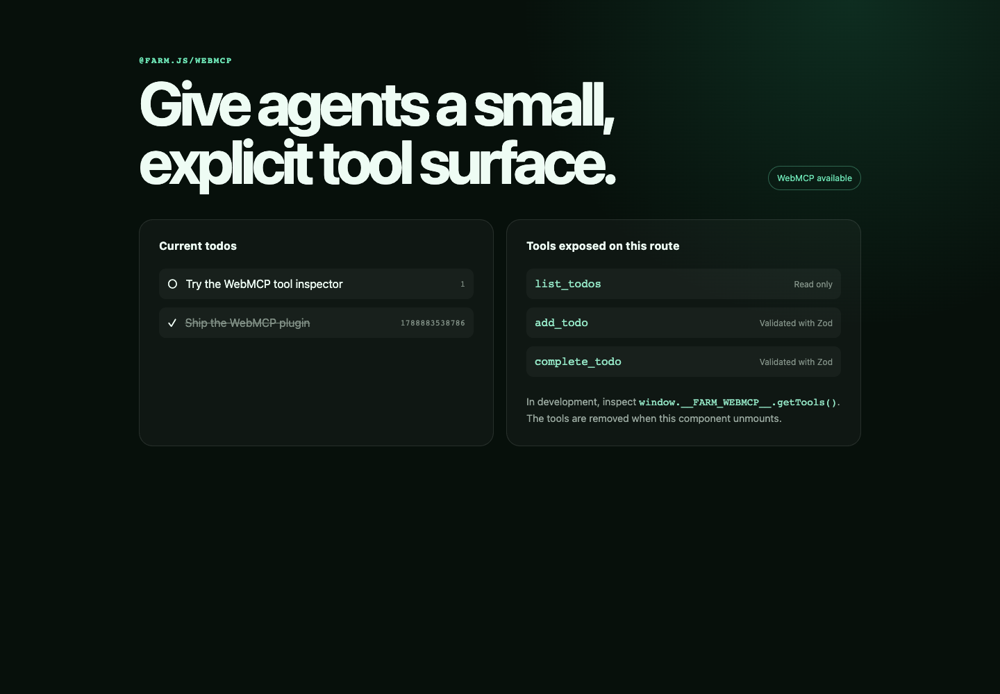

# Farm WebMCP demo

This example registers three explicit route-owned browser tools through `@farm.js/webmcp`.



```bash
pnpm dev
```

Use a browser that implements the current WebMCP draft. During local development, the plugin also
exposes `window.__FARM_WEBMCP__.getTools()` so the registered metadata can be inspected without an
agent.
